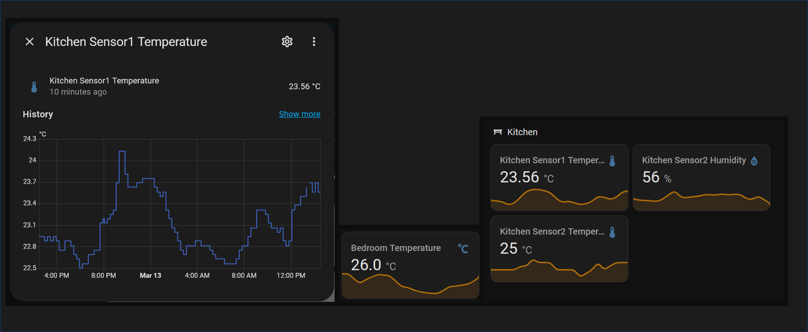

# MatrixChrono - IoT Smart Home Clock System

## MatrixChrono_ESP32-NeoMatrix

- **Microcontroller**: ESP32  
- **Display**: NeoPixel Matrix [256 LEDs]  
- **Sensors**:
    - 🌡️ DS18B20 Temperature Sensor
    - 🕒 RTC DS3231 for precise timekeeping  
- **Features**:
    - 💻 Web pages for configuration (forms, color wheel, graph plotting)
    - 🌙 Night mode with brightness adjustments
    - 💾 EEPROM-based persistent storage [WIP]
    - 🛜 Wi-Fi portal for configuration
    - 🌈 Gradual color-changing function that rotates clock colors every hour

-----

## 🔨 **[This Page is a Work in Progress]**  🔨

---

### ⚙️ **Hardware Requirements**

- **Power Supply (PSU)**  
  - **1x 5V or 12V* PSU**  
  - If you want the Neopixels to be bright, calculate your power needs:  
    - **Approx. 0.3W per Neopixel at full brightness** (e.g., 256 Neopixels → ~77W).  
    - Running Neopixels at full power is **unnecessary** as they become excessively bright.  
    - The sketch includes a **(WIP) automatic brightness calibration** feature:  
      - It gradually increases brightness until the PSU cuts power
      - The maximum safe brightness level is stored in EEPROM.  
      - If the PSU is overdrawn, a good PSU will handle the overload momentarily before cutting power.  
      -   A `max_brightness_limit` will be added to the sketch, serving as a hard limit based on the circuit wiring.
  
  - **⚠️ Important: ❌ NOT RECOMMENDED:** Running Neopixels at full power requires:   
    - **Thicker (lower gauge) wiring** to handle the current safely.  
    - **Proper fuses or circuit protection** to prevent overheating or damage.  
    -  If you need to run at such high power, consider using **12V Neopixel modules instead** to reduce current draw and wiring issues.  
    - 🔥**RISK OF FIRE IF NOT PROPERLY CONFIGURED** – Ensure you use appropriate fuses, wiring, and protection to avoid overheating and potential damage.
    - Reduces the lifespan of individual LEDs, especially for those that remain static.

- **Core Components**  
  - **1x ESP32 Dev Board**  
  - **1x RTC DS3231 Module** (Real-Time Clock)  
  - **1x DS18B20 Temperature Sensor**  
  - **4x 8x8 Neopixel-Based Modules**  
  - **1x Push Button**  

- **Optional Components**  
  - **1x Slider/Toggle Switch** (high amperage rating)  
  - **1x Power Filter Board**  
  - **1x Step-Down Converter** (12V → 5V)

⚠️ *The Neomatrix boards I'm using operate at **5V**, and the ESP32 dev board also runs at **5V**.  
If your Neomatrix requires a different voltage, refer to the wiring diagram and make necessary changes.*  
  
In my design, I implemented **two step-down converters**, each rated for **3A**:  

- This allows me to theoretically run at **72W (~0.28W per WS2812 LED)**—more than I'll ever need since they are so bright.  
  - **One step-down converter** powers half the Neopixel matrix, the ESP32, temperature sensor, and RTC.  
  - **The other step-down converter** powers the remaining half of the matrix.  

In my case, I will always be limited by the PSU output, and for a V2, I will make sure to add a VIN fuse to prevent drawing more power than the circuit was designed for. The approach I followed in this case is a safer one, as I split the power safely, avoiding overdraw from the step-down modules. Realistically, I will set the `max_brightness` in the sketch to a safe value, preventing the LEDs from running at their highest power, and I will limit the power drawn in the sketch to prevent a user from setting it too high.  

🚩 Make sure you set the `max_brightness` to a safe value according to the gauge of your wiring 🚩  

----

### ⚡ **Wiring Diagram**  

-----

### 🧑‍💻 **Instructions**

If you'd like to recreate this project, feel free to do so and contribute! This is a personal project, and while I appreciate any contributions, I can't guarantee long-term maintenance.

I'll provide the code and general instructions, but I won't be offering in-depth tech support. This is a DIY project.

### Setup Instructions

1. **Connect the Modules**

   Follow the wiring diagram to set up the hardware.

   **Important Notes:**
   - **VCC and Neopixel Isolation**: Use a switch to separate the ESP32 and Neopixel module power. This prevents the Neopixel from drawing power through the USB interface when programming the board.
   - **Stable Voltage Supply**: Ensure the Neopixel module receives clean, stable voltage.
   - **Common Grounding**: All modules must share a common ground.
   - **Signal Integrity**:
     - Use a shielded cable for the Neopixel signal wire OR keep the cable short.
     - Avoid routing the signal wire near antennas, coils, or other interference-prone components.  
   🚨 **Failure to follow these steps may cause erratic behavior**—such as incorrect LED colors, flickering, or other malfunctions.
   
2. **Library/Boards Manager Versions:**
Make sure you set your libraries to the following versions. (Libraries without version-specific requirements are omitted.)
- [DallasTemperature](https://github.com/milesburton/Arduino-Temperature-Control-Library): V3.9.0 [TODO: Update sketch to comply with the library changes]
 - ESP32 by Espressif: V2.0.17 [Versions >V3 have issues with Adafruit NeoPixel and NeoMatrix libraries]
     

1. **Upload the Sketch to the ESP32**

   - Toggle the Neopixel power switch OFF before programming.
   - Connect the ESP32 to your computer via USB and verify it appears as a serial device.
   - Create a `Secrets.h` file and add your API key for WeatherAPI:  
     `String APIKEY = "YOUR_API_KEY";`

2. **Power Up**

   - Remove the USB connection, slide the Neopixel power switch to the ON position, and connect the PSU power.  

-----

## 🛠️ **Initial Setup**

  -   **Connect to the Wi-Fi portal for initial Wi-Fi setup:** [WifiManager](https://github.com/tzapu/WiFiManager)
        - Connect to the Wi-Fi SSID shown in the screen of the module: "CLOCK_AP"
        - Access the IP: `192.168.1.4`
        - Connect to your Wi-Fi with your password
        - The board will reset, and after a successful connection, the clock will display.

-   **Access the web interface to customize settings:**
    - Set up the [POSIX](https://github.com/ropg/ezTime?tab=readme-ov-file#timezones-1) according to your timezone.  
    - Set up the [API KEY](https://weatherapi.com) for weatherapi.com.  
    - Customize other settings according to your preferences.

--------
## 📡 API & Home Automation Integration (HomeAssistant)

MatrixChrono provides a JSON output of sensor data, making it compatible with **Home Assistant**.  
https://www.home-assistant.io/  

Configuration.yaml example:
    
*`/homeassistant/configuration.yaml`*

For ***MatrixChrono_ESP32-NeoMatrix***

    sensor:
      - platform: rest
        name: "MatrixChrono_ESP32-NeoMatrix Temperature"
        unit_of_measurement: "°C"
        resource: "**MATRIXCHRONO_IP_ADDRESS**/JsonSensorData"
        scan_interval: 900
        value_template: "{{ value_json.Temperature }}"
        device_class: temperature
        unique_id: "UNIQUEID"

Make sure you change **MATRIXCHRONO_IP_ADDRESS** and **UNIQUEID** depending on your settings. 

------
MatrixChrono © 2025 by João Fernandes is licensed under Creative Commons Attribution-NonCommercial 4.0 International

To view a copy of this license, visit: http://creativecommons.org/licenses/by-nc/4.0/