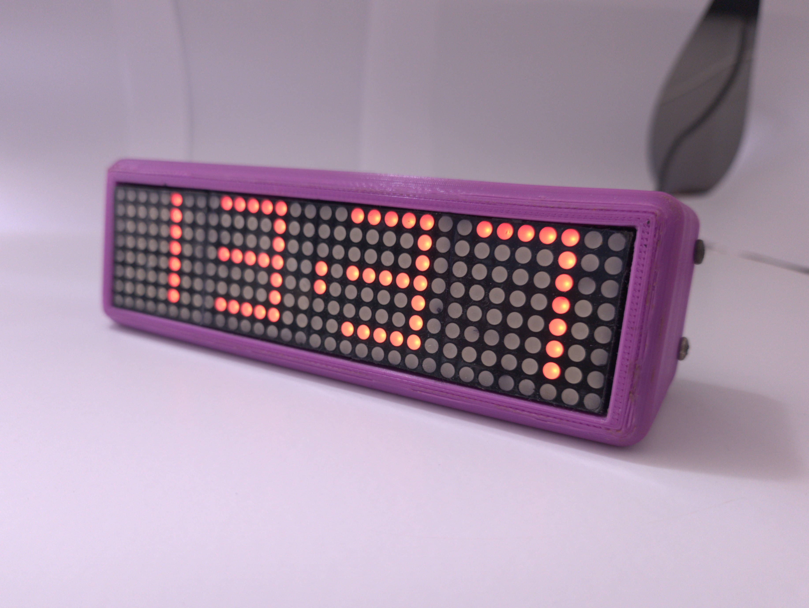
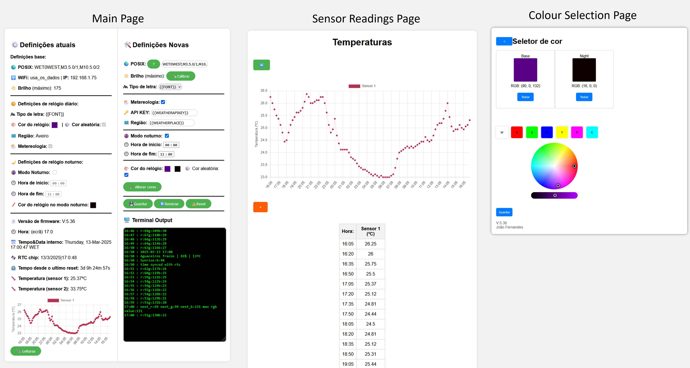

# MatrixChrono - IoT Smart Home Clock System

**MatrixChrono** is a collection of IoT-enabled smart home clock systems featuring real-time weather updates, sensor feedback, and home automation integration. Using matrix-based LED displays, it offers a sleek and functional way to track time, temperature, and more. The project supports two hardware configurations: one with ESP8266 and MAX7219 displays, and another with ESP32 and a NeoPixel matrix. 

## 🚀 Features

-   🌡️ **Sensor Integration**: Supports DS18B20, DHT11 for temperature/humidity sensing.

-   ⏰ **Automatic Time Updates**: Syncs time via NTP, automatic DST adjustment.

-   🌎 **Weather Updates**: Retrieves weather data hourly from WeatherAPI.com.

-   📡 **Wi-Fi Configuration**: Uses WiFiManager for easy network setup. 

-   📊 **[Web Interface](#-web-interface)**: HTML + CSS-based configuration page with a temperature graph. Color selection, multiple fonts, and night mode.

-   🔄 **OTA Updates**: Firmware updates over-the-air for seamless upgrades.

-   🏡 **[Home Assistant Integration](#-api--home-automation-integration-homeassistant)**: JSON sensor output for smart home automation. []
----------

## 📖 Project History

MatrixChrono began in 2018 as a simple assembly of a clock with a 3D-printed shell, using code examples from the web. The project truly evolved in 2020 when I decided to rewrite everything from scratch to gain a deeper understanding of the code and make customizations as needed. The initial version was built around ESP8266 and MAX7219 displays, featuring basic sensors and a simple web interface.

In 2023, I challenged myself to create a more advanced version using NeoPixel matrices and the ESP32 platform. This new iteration pushed my boundaries in both electronics and software development, incorporating more complex animations and dynamic web pages rather than static content.

Both projects remain works in progress. Future plans include standardizing capabilities across both versions by bringing the improved web interface to the ESP8266 variant. For the NeoPixel-based version, I aim to implement more sophisticated functions, colorful animations, and icon support. A hardware revision (V2) of the ESP32-NeoMatrix is also planned, featuring a circular grid pattern in front of the LEDs to improve text readability compared to the current square grid design.

Some known bugs exist that I intend to address when time permits. This is my personal ongoing project that continues to evolve as my skills improve and new ideas emerge.

  

----------

## 🔧 Hardware Variants

The project supports two hardware configurations:

### MatrixChrono_ESP32-NeoMatrix

-   **Microcontroller**: ESP32
-   **Display**: NeoPixel Matrix [256 leds]
-   **Sensors**:
    -   🌡️ DS18B20 Temperature Sensor
    -   🕒 RTC DS3231 for precise timekeeping
-   **Features**:
    -   💻 Web pages for configuration (forms, color wheel, graph plotting)
    -   🌙 Night mode with brightness adjustments
    -   💾 EEPROM-based persistent storage [wip]
    -   🛜 Wi-Fi portal for configuration
    -   🌈 Gradual color changing function that rotates clock colors every hour

### MatrixChrono_ESP8266-MAX7219

-   **Microcontroller**: ESP8266
-   **Display**: MAX7219 4x 8x8 LED Matrix 
-   **Sensors**:
    -   🌡️ DHT11 (for humidity and temperature)
    -   🌡️ DS18B20 for more accurate temperature readings
-   **Features**:
    -   🕒 Custom timekeeping function
    -   🌙 Night mode with reduced brightness
    -   💾 EEPROM-based persistent storage
    -   🏠Home Assistant JSON output  

----------

## 🛠️ Tech Stack

-   **Firmware**: C, C++, Arduino
    
-   **Hardware**: ESP32, ESP8266, MAX7219, NeoPixel, Sensors (DS18B20, DHT11, RTC DS3231)
    
-   **Web Interface**: HTML, CSS
    
-   **Networking**: WiFi, NTP

----------
## 📚 Libraries Used

> *"If I have seen further, it is by standing on the shoulders of
> giants."* — Sir Isaac Newton

### **MatrixChrono_ESP32-NeoMatrix**

-   [WiFiManager](https://github.com/tzapu/WiFiManager)
  
-   [WebServer](https://github.com/espressif/arduino-esp32/tree/master/libraries/WebServer)
    
-   [WiFiClient](https://github.com/espressif/arduino-esp32/tree/master/libraries/WiFi)
    
-   [CircularBuffer](https://github.com/rlogiacco/CircularBuffer)
    
-   [EEPROM](https://github.com/espressif/arduino-esp32/tree/master/libraries/EEPROM)
    
-   [ArduinoOTA](https://github.com/esp8266/Arduino/tree/master/libraries/ArduinoOTA)
    
-   [Adafruit GFX](https://github.com/adafruit/Adafruit-GFX-Library)
    
-   [Adafruit NeoMatrix](https://github.com/adafruit/Adafruit_NeoMatrix)
    
-   [Adafruit NeoPixel](https://github.com/adafruit/Adafruit_NeoPixel)
    
-   [ArduinoJson](https://arduinojson.org/)
    
-   [RTClib](https://github.com/adafruit/RTClib)
    
-   [ezTime](https://github.com/ropg/ezTime)
  
-   [OneWire](https://github.com/PaulStoffregen/OneWire)   
    
-   [DallasTemperature](https://github.com/milesburton/Arduino-Temperature-Control-Library)
    

### **MatrixChrono_ESP8266-MAX7219**

-   [ArduinoOTA](https://github.com/esp8266/Arduino/tree/master/libraries/ArduinoOTA)
    
-   [ESP8266HTTPClient](https://github.com/esp8266/Arduino/tree/master/libraries/ESP8266HTTPClient)
    
-   [WiFiClient](https://github.com/esp8266/Arduino/tree/master/libraries/ESP8266WiFi)
    
-   [NTPClient](https://github.com/arduino-libraries/NTPClient)
    
-   [WiFiManager](https://github.com/tzapu/WiFiManager)
    
-   [ESP8266mDNS](https://github.com/esp8266/Arduino/tree/master/libraries/ESP8266mDNS)
    
-   [ArduinoJson](https://arduinojson.org/)
    
-   [MD_Parola](https://github.com/MajicDesigns/MD_Parola)
    
-   [MD_MAX72xx](https://github.com/MajicDesigns/MD_MAX72XX)
    
-   [DHT Sensor Library](https://github.com/adafruit/DHT-sensor-library)

- [OneWire](https://github.com/PaulStoffregen/OneWire)   
    
-   [DallasTemperature](https://github.com/milesburton/Arduino-Temperature-Control-Library)
    
-   [ezTime](https://github.com/ropg/ezTime)

------
## 📜 Installation & Setup

If you’d like to recreate this project, feel free to do so and contribute!  
This is a personal project, and while I appreciate any contributions, I can’t promise to maintain it indefinitely.  
While I provide the code and general instructions, I won't be providing in depth tech support. DIY project.

### Requirements
 - Choose a specific config: **MatrixChrono_ESP32-NeoMatrix** OR **MatrixChrono_ESP8266-MAX7219**

 - Read the documentation inside each for specific instructions.

------

## 📡 API & Home Automation Integration (HomeAssistant)

MatrixChrono provides a JSON output of sensor data, making it compatible with **Home Assistant**.  
https://www.home-assistant.io/  

------
## 🌐 Web Interface
Acess the webpages by navigating to the IP of the MatrixChrono. The IP is shown everytime the module is started.  
[todo: make the module accessible thru hostname address.]
  
  

MatrixChrono_ESP32-NeoMatrix Example pages  

[todo: update the pages on the MatrixChrono_ESP8266-MAX7219]

------
## 🔧 General Troubleshooting
- **Sketch not uploading?**  Verify library versions  
- **Sketch uploaded but nothing is displayed?**  Check wiring, or library versions, verify log output on serial interface  
- **Weather not displaying?** Ensure API key is correctly configured.   

 ------
## 📜 License

This project is licensed under the **Creative Commons Attribution-NonCommercial 4.0 International License (CC BY-NC 4.0)**
Creative Commons Attribution-NonCommercial 4.0 International License (CC BY-NC 4.0)

MatrixChrono © 2025 by João Fernandes is licensed under Creative Commons Attribution-NonCommercial 4.0 International 

See the [LICENSE](LICENSE.txt) file for details  
Or visit:  
[http://creativecommons.org/licenses/by-nc/4.0/](http://creativecommons.org/licenses/by-nc/4.0/)  

or send a letter to:

    Creative Commons
    PO Box 1866  
    Mountain View,    
    CA 94042  
    USA  

In summary (not a substitute for the full license):
- You are free to share and adapt the material for non-commercial purposes
- You must give appropriate credit and indicate if changes were made
- You may not use the material for commercial purposes without specific permission

